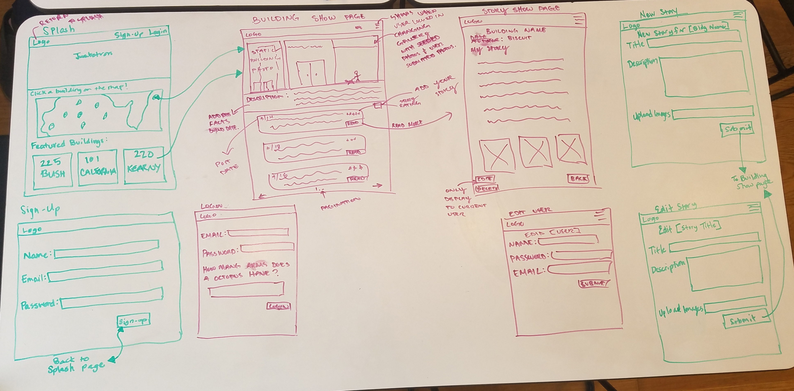

# README

# What’s that building?

## What is this project?
A one stop shop for all things building. See building facts, post your own stories and pictures.

## Why buildings?
At “What’s that building?” We have a love for building architecture, design and stories. We spend restless nights thinking, “Why did they build this?” “Who’s been through these hallways?” “Why is it shaped the way it shaped?”

So why not create a place to share all things building related.  

### What can I find in this repo?
This repository is for the organization and governance of the “What’s that building?” project as a whole. For code, see (https://github.com/drstrangele/building-story-app).

# Goals
Create a place for building lovers to share stories and facts.

# Project Timeline
* Part 1 - Initial planning phase: Research other building sites, create user stories, wireframes, data-model relations, determine group strengths
* Part 2 - Coding: Setting up routes and making sure basic functionality works
* Part 3  - Views, extra features and dividing up tasks: Set up responsive google maps, navbar and background. Created form pages. Adding gems to handle uploads, pagination and image gallery.
* Part 4 - Ice Cream: Afternoon Ice Cream sandwich break.
* Part 5 - Site walk through: Fixing broken features or links.
* Part 6 - Last run through before presentations

##User Contribution
New buildings can only be added through by admin team. If you would like to suggest a new building site. Please contact us at ……….

## Developement Team
Aly Shae,  Nuranne Dairkee, Cindy Le

## Built With
* ruby on rails
* bootstrap 3.3.7
* paperclip - ImageMagick
* jquery-rails
* geocoder
* gmaps4rails
* font-awesome-sass
* fotorama
* will_paginate

## Deployment
Heroku: https://whatsthatbuilding.herokuapp.com/

## Acknowledgments
* Hat tip to our previous vagabond projects for helping us with code
* OldSF for site inspirations and building love (http://www.oldsf.org/# )
* Google - for bringing clarity in our time of confusion

## Wireframes:

## User Stories:
## Sprint 1: Basic Auth & Profiles
**A user should be able to:**
1. Navigate to "/" and see a basic splash page with:
  * Site-wide header 
  * Jumbotron with photos of buildings
  * View all buildings as an index on splash page
  * 3 Featured buildings (displayed as cards), when clicked, redirected to corresponding building page 
2. Sign up for an account.
  * Require name, email, and password
  *  A user CANNOT sign up with an email (or username) that is already in use.
  * After signup, return to splash page
3. Log in to their account if they already have one.
  * Require email, password
4. Be redirected to splash page after logging in.
5. See Site-wide header on every page with:
  * Name/logo of site, when clicked, returns user to splash page
  * A link to "Log Out" if they're logged in.
  * Links to "Log In" and "Sign Up" if they're logged out.
  * Drop down menu allowing user to navigate site after logged in
6. Update their profile by making changes to their name and/or email.

## Sprint 2: CRUD (storey)
**A user should be able to:**
1. View the "255 Bush St" page (at "/buildings/1") including:
  * The site-wide header.
  * The location of the building (address)
  * An iconic photo of the building.
  * User generated photos in gallery (added when user adds/edits storey)
  * A brief description of the building
    -build date, architect, cool facts
2. View a list of stories on the Building page:
  * Sorted by newest first with post date displayed.
  * With the story titles linked to the individual story "show" pages.
  * truncated with link to read more
  * Pagination, no more than 10 stories per page
3. View individual story
  * building name, post date, author, description, photos.
  * view Edit and Delete buttons for a story (only if authorized)
  * Back button, returns to Building page
4. Use an "Add New Story" button on the Building page to pull up the new story form.
5. Create a new story for Building (only if logged in)
  * require title, description, images
  * Submit button to return to Building page
6. Edit story page for building (only if authorized)
  * require title, description, images
  * render previous info 
  * Submit button to return to Building page

## Sprint 3: Validations & Authorization
**A user should be able to:**
1. View building pages for "SF Ferry Building" and "114 Sansome St.".
2. Verify that a new story they create is successfully published on the correct building page.
**A user CANNOT save invalid data to the database, according to the following rules:**
1. A story's title must be between 1 and 200 characters.
2. A story's content must not be empty.
**A user is authorized to perform certain actions on the site, according to the following rules:**
1. A user MUST be logged in to create/update/destroy resources.
2. A user may ONLY edit their own profile and edit/delete their own story.
3. View an error message when form validations fail, for the following validations:
  * Title must be between 1 and 200 characters.
  * Description must not be empty.
4. View only the 10 most recent story's on a building page (pagination), with
  * A link/button to the "Next" 10.
  * A link/button to the "Previous" 10.

## Sprint 4: (BONUS) Commenting
**A user should be able to:**
1. Comment on an individual story.
2. Only add a comment when logged in.
3. Only edit/delete their own comments.
4. Allow users to upvote story's
4. Display story's by ranking upvotes

## Sprint 5: Bonuses:
**A user should be able to:**
1. Receive a welcome email after creating an account.

**A user should be able to:**
1. Visit building pages via pretty urls, like "/building/255BushSt ".
2. View map on splash page with markers on a map linking to corresponding building page
